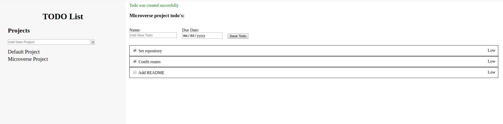

# TODO List

> The clasic Todo-list project.

    

In this project we put in practice the [Single Responsibility](https://en.wikipedia.org/wiki/Single-responsibility_principle) and [Loosely Coupled Objects](http://thephantomprogrammer.blogspot.com/2015/07/strive-for-loosely-coupled-design.html) principles by organizing the project in different modules and implementing [Publish/Subscribe design pattern](src/pubsub.js) in the application logic.

## Built With

- CSS
- HTML
- JavaScript
- [webpack](https://webpack.js.org/)

## Live Demo

[https://fivan18.github.io/todo-list/](https://fivan18.github.io/todo-list/)

## Getting Started

To get a local copy up and running follow these simple example steps.

### Prerequisites

Download the project

    $ git clone https://github.com/fivan18/todo-list.git

Install the dependencies

    $ npm install

### Usage

- Open **index.html** file with your favorite browser. It's inside the project's root directory.
- That's it. Let's start recording your todos.

## Authors

👤 **Ivan Ulises Guzman Sanchez**

- Github: [@fivan18](https://github.com/fivan18)
- Twitter: [@fivanunam](https://twitter.com/fivanunam)
- Linkedin: [fivan](https://www.linkedin.com/in/fivan)

👤 **Juan Pablo Gil**

- [GitHub](https://github.com/JuanPabloGil ) 
- [@LinkedIn](https://www.linkedin.com/in/juan-pablo-gil-1321a515a/) 
- jpablomgil@gmail.com

## 🤝 Contributing

Contributions, issues and feature requests are welcome!

Feel free to check the [issues page](https://github.com/fivan18/todo-list/issues).

## Show your support

Give a ⭐️ if you like this project!

## Acknowledgments

- Thanks to [Addy Osmani](https://twitter.com/addyosmani) for the [Publish/Subscribe implementation](src/pubsub.js)

- Thanks [date-fns](https://github.com/date-fns/date-fns) for the library 

## 📝 License

This project is [MIT](LICENSE) licensed.
